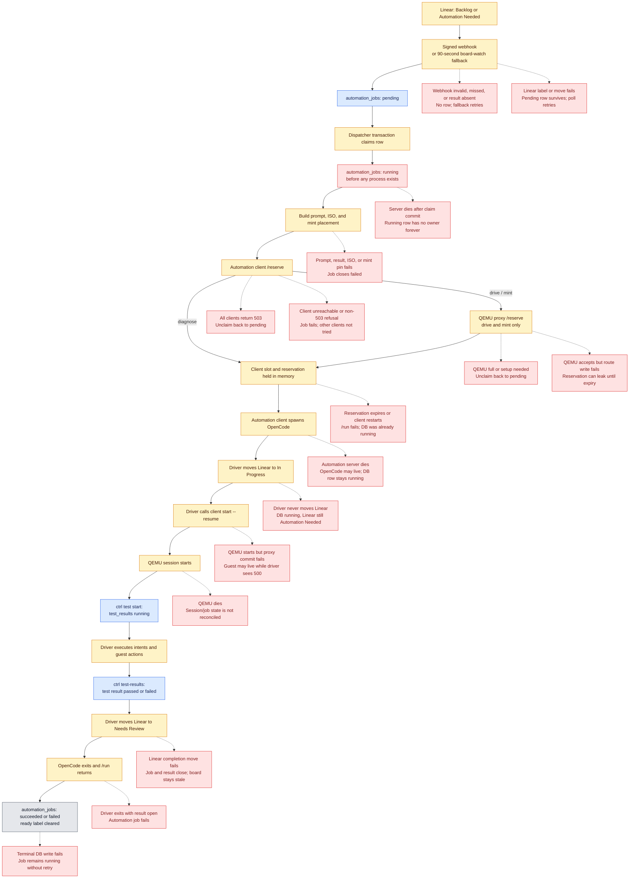
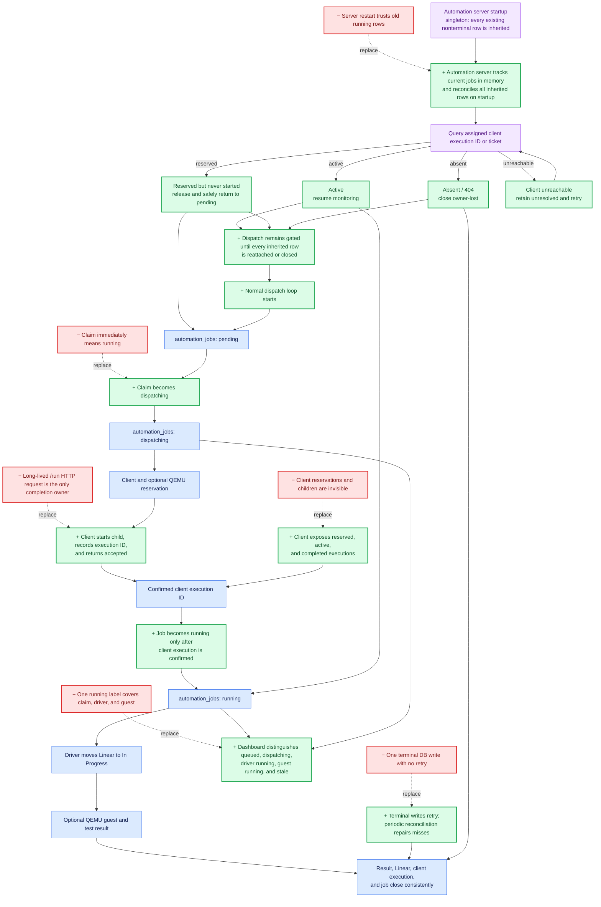

# Automation State Must-Fix Checklist

Work top to bottom, one numbered section at a time. Write and observe each failing test before
changing production code. Check an item only after its tests and implementation are committed.

## Current flow and failure points

## Planned flow: remove red, add green

## 1. Reconcile orphaned running jobs after process death

- [ ] Add an integration test that SIGKILLs `automation-server` with a drive in progress, restarts
      it, and proves the old `automation_jobs` row does not remain `running`.
- [ ] Add an integration test for death after `claim` but before `/reserve` returns.
- [ ] Add an integration test for death after `/reserve` succeeds but before `/run` starts.
- [ ] Add an integration test for death while `/run` is waiting on the automation client.
- [ ] Add an unhappy-path test that a failed terminal `finish` database write is retried or later
      reconciled.
- [ ] Track every claim and perform fiber owned by the current singleton automation-server in
      memory.
- [ ] On startup, treat every existing nonterminal row as inherited work and reconcile it against
      the assigned automation client.
- [ ] Run startup reconciliation before the dispatch loop may claim any pending job.
- [ ] Do not assume an inherited row is dead: its OpenCode child may still be active on the
      automation client after the previous server connection disappeared.
- [ ] Reattach monitoring to a confirmed active execution, release a reservation that never
      started, close an absent execution owner-lost, and retain an unreachable execution as
      unresolved for retry.
- [ ] Keep new dispatch gated while inherited work is unresolved so a restart cannot exceed real
      client or QEMU capacity.
- [ ] Periodically reconcile database-running rows that are absent from the current process's
      ownership registry.
- [ ] Abort client work before closing inherited work when the automation client still owns that
      ticket.
- [ ] Treat a client `404` during inherited-work cleanup as confirmation that no process remains,
      then close the job with an explicit owner-lost reason.
- [ ] Never requeue work whose side effects are uncertain; close it terminally unless the durable
      phase proves `/run` never started.
- [ ] Prove that one automation client configured for six jobs cannot leave more than six
      client-confirmed `running` rows after reconciliation.

## 2. Make graceful shutdown stop the work it claims to abort

- [ ] Replace the test that permits OpenCode to outlive a disconnected automation-server with a
      test for the chosen explicit ownership contract.
- [ ] Add a test that SIGTERM stops each client child before its job becomes `aborted`.
- [ ] Add a test that shutdown waits for every terminal database transition.
- [ ] Have `automation-server` call the owning client's `/abort` during graceful shutdown.
- [ ] Mark the job `aborted` only after the client confirms the child stopped or confirms it no
      longer exists.
- [ ] Keep shutdown bounded and record a distinct failure when client cleanup cannot be confirmed.

## 3. Make automation-client execution observable and restart-safe

- [ ] Add tests for a client instance restarting on the same URL with reservations and runs active.
- [ ] Add tests for querying a client's reservations and active ticket processes.
- [ ] Give every automation-client process a startup instance ID.
- [ ] Publish the instance ID, configured `max-jobs`, current reservations, and active runs through
      its heartbeat or a status endpoint.
- [ ] Record the client instance ID on the durable job claim.
- [ ] Reject completion or abort acknowledgements from a different client generation.
- [ ] Ensure a restarted client begins with no inherited claims and lets reconciliation close the
      previous generation's jobs.

## 4. Reconcile QEMU death with durable sessions

- [ ] Add an integration test that SIGKILLs a QEMU server with active sessions and restarts it.
- [ ] Add a test that graceful QEMU shutdown closes every session before releasing its slots.
- [ ] Add a test that a QEMU restart does not make old database sessions appear live.
- [ ] Give each QEMU process a startup instance ID and persist it with routed sessions.
- [ ] On startup, close nonterminal sessions owned by the previous instance with an explicit
      owner-lost reason.
- [ ] Ensure the affected driver receives a terminal failure instead of waiting indefinitely.
- [ ] Reconcile the corresponding automation job after the driver exits or its client owner is
      lost.

## 5. Make every terminal job transition durable

- [ ] Add a unit test for a transient database failure in `AutomationStore.finish`.
- [ ] Add a test for exhaustion of the terminal-write retry policy.
- [ ] Retry terminal writes with a bounded backoff while the worker still owns the job locally.
- [ ] Leave the job and client execution information available to the reconciliation pass when
      retries are exhausted.
- [ ] Use `timed_out` or remove it from the automation-job vocabulary; do not retain a terminal
      status that no code can write.

## 6. Unify abort behavior across API, dashboard, and terminal UI

- [ ] Add a dashboard integration test for automation-client `404` during abort.
- [ ] Add tests for abort when the assigned client row is missing, stale, or unreachable.
- [ ] Replace tests that intentionally leave a job `running` after a confirmed client `404`.
- [ ] Treat `404` as already stopped and close the durable job.
- [ ] On 5xx or unreachable clients, keep retryable ownership information instead of reporting a
      successful abort.
- [ ] Make a successful dashboard response require that the durable row is terminal.
- [ ] Make the dashboard, `viz`, and direct automation-server callers report the same outcome.

## 7. Separate claimed, driver-running, and guest-running states

- [ ] Add rendering tests for each business state without asserting presentation details.
- [ ] Add query tests that classify an unowned inherited row as stale rather than live.
- [ ] Persist a dispatch phase that distinguishes a database claim from confirmed client
      execution.
- [ ] Show `dispatching`, `driver running`, `guest running`, and `stale` separately.
- [ ] Count dashboard `running` only when a live client generation confirms the execution.
- [ ] Show queued depth separately from concurrency so `pending 29` is not presented as a
      six-slot violation.

## 8. Make capacity a verifiable fleet invariant

- [ ] Add a test that the sum of live client jobs never exceeds the sum of their configured
      `max-jobs`.
- [ ] Add a test that database-running jobs equal confirmed client reservations plus active
      runs after reconciliation.
- [ ] Persist or publish each client's configured capacity.
- [ ] Add an operator-visible discrepancy when database claims exceed confirmed client work.
- [ ] Decide whether pending queue depth is intentionally unbounded or capped; document and test
      that policy.
- [ ] If only six tickets should leave Backlog at once, admit against available slots rather than
      `live.length` on every board poll.

## 9. Permit an intentional retry after terminal infrastructure failure

- [ ] Add tests for retrying a failed drive while still forbidding two nonterminal jobs for the
      same result and action.
- [ ] Replace the permanent `(result_id, action)` uniqueness rule with one-nonterminal-job
      enforcement, or add an explicit attempt model.
- [ ] Preserve every terminal attempt for history.
- [ ] Make Linear and dashboard messages name the existing attempt's real terminal status.

## 10. Make placement failures recoverable

- [ ] Add a worker test that one unreachable automation client does not fail the job while another
      live client can accept it.
- [ ] Add a proxy test for a QEMU server dying between probe and reserve.
- [ ] Try the remaining eligible automation clients after a transient reserve failure.
- [ ] Try the remaining eligible QEMU servers after a selected server fails its reserve request.
- [ ] Preserve the original network cause in `automation-client/qemu.ts`.
- [ ] Require the automation client's QEMU proxy URL at startup instead of silently defaulting to
      an unrelated local port.

## 11. Repair existing inconsistent production rows

- [ ] Add a read-only audit that lists every `running` automation job with its result, session,
      assigned client, client generation, started age, and confirmed client process.
- [ ] Define deterministic classifications for active, completed-but-unclosed, never-started, and
      owner-lost rows.
- [ ] Test the repair against fixtures for every classification.
- [ ] Stop confirmed client processes before changing their rows.
- [ ] Close completed-but-unclosed rows from their recorded result.
- [ ] Close owner-lost and uncertain rows with explicit reasons; do not silently call them passed.
- [ ] Run the repair once after startup and periodic reconciliation are deployed.
- [ ] Confirm that durable running counts, client jobs, and QEMU jobs agree afterward.
