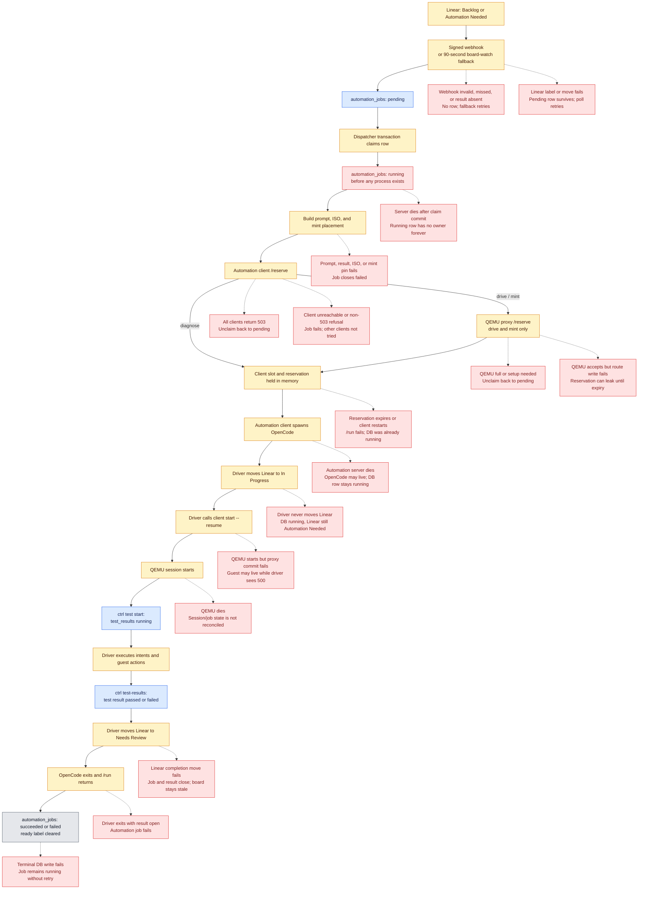
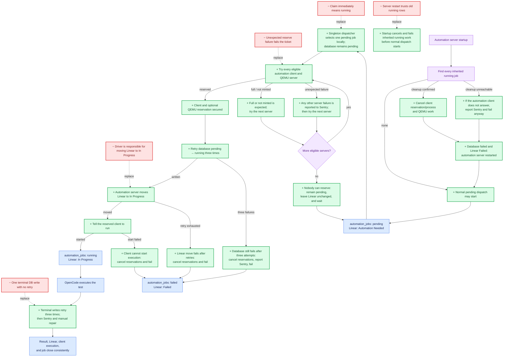

# Automation State Must-Fix Checklist

Work top to bottom, one numbered section at a time. Write and observe each failing test before
changing production code. Check an item only after its tests and implementation are committed.

## Current flow and failure points

## Planned flow: remove red, add green

## 1. Reconcile orphaned running jobs after process death

- [x] Add an integration test that SIGKILLs `automation-server` with a drive in progress, restarts
      it, and proves the old `automation_jobs` row does not remain `running`.
- [x] Add an integration test for death while `/reserve` is in flight and the database row is
      still `pending`.
- [x] Add an integration test for death after `/reserve` succeeds but before `/run` starts. The
      automation server dies while the automation client reserves, and the automation client
      still grants it, so it holds a reservation while the row is `pending`. The next automation
      server reserves the same ticket there again, which answers ok without asking QEMU, and the
      drive runs. Death after the `running` write is the `/run` waiting case: startup stops it at
      its automation client and fails it.
- [ ] Add an integration test for death after the database becomes `running` but before Linear
      moves to In Progress.
- [ ] Add an integration test for death after Linear moves to In Progress but before `/run`.
- [x] Add an integration test for death while `/run` is waiting on the automation client.
- [x] Add an unhappy-path test that a failed terminal `finish` database write is retried or later
      reconciled.
- [ ] ~~Track every reservation attempt and perform fiber owned by the current singleton
      automation-server in memory.~~ Dropped: user decision. Every running row at startup is the
      dead process's; nothing needs a registry.
- [x] On startup, treat every existing nonterminal row as inherited work and reconcile it against
      the assigned automation client. A pending row needs nothing: dispatch places it as usual.
- [x] Run startup reconciliation before the dispatch loop may select any pending job.
- [x] Do not assume an inherited row is dead: its OpenCode child may still be active on the
      automation client after the previous server connection disappeared.
- [x] Cancel a confirmed reservation or active execution before moving its database row and Linear
      issue to Failed.
- [x] Treat an absent execution as already stopped, ~~and retain an unreachable execution as
      unresolved for retry~~. Changed: user decision. An automation client that does not answer
      is reported to Sentry and the job is failed anyway; nothing retries it.
- [ ] ~~Keep new dispatch gated while inherited work is unresolved so a restart cannot exceed real
      client or QEMU capacity.~~ Dropped: user decision. An unreachable automation client does not
      block dispatch.
- [ ] ~~Periodically reconcile database-running rows that are absent from the current process's
      ownership registry.~~ Dropped: user decision (Sentry, then manual repair).
- [x] Abort client work before closing inherited work when the automation client still owns that
      ticket.
- [x] Treat a client `404` during inherited-work cleanup as confirmation that no process remains,
      then close the job with an explicit owner-lost reason (`automation server restarted`). The
      `404` is reported to Sentry as `JobNotFound` (user decision: a `404` for a running job is
      always reported).
- [x] Never requeue work whose side effects are uncertain; close it terminally unless the durable
      state proves `/run` never started.
- [x] An inherited drive or mint whose result its driver already closed has finished: close it
      `succeeded`, and send nothing to its automation client or Linear. User decision.
- [x] Prove that one automation client configured for six jobs cannot leave more than six
      client-confirmed `running` rows after reconciliation.

## 2. Make graceful shutdown stop the work it claims to abort

- [x] Replace the test that permits OpenCode to outlive a disconnected automation-server with a
      test for the chosen explicit ownership contract. The contract: a dropped `/run` leaves
      OpenCode running, and `POST /abort` is what stops it.
- [x] Add a test that SIGTERM stops each client child before its job becomes `aborted`.
- [x] Add a test that shutdown waits for every terminal database transition.
- [x] Have `automation-server` call the owning client's `/abort` during graceful shutdown. Every
      client with a job running is asked at once.
- [x] Mark the job `aborted` only after the client confirms the child stopped or confirms it no
      longer exists. A `404` is reported to Sentry as `JobNotFound`, then the job is `aborted`.
- [x] Keep shutdown bounded and record a distinct failure when client cleanup cannot be confirmed.
      Ten seconds for every client together. A stop that fails or gets no answer is reported
      `shutdown abort failed; <url>`, and the row stays `running`, so the next startup stops and
      fails it.

## 3. Make automation-client execution observable and restart-safe

- [ ] Add tests for a client restarting on the same URL with reservations and runs active.
- [ ] Add tests for querying a client's reservations and active ticket processes.
- [ ] Publish configured `max-jobs`, current reservations, and active runs through the heartbeat or
      a status endpoint.
- [x] Make reserving the same ticket and action idempotent so a crash after reservation can safely
      retry while the database row is still pending. The same action, iso and pin again answer ok
      and keep the first deadline. Anything else for that ticket is still 400 `already reserved`.
- [ ] Add one idempotent cancellation operation that releases either an unused reservation or an
      active OpenCode process and its QEMU resources.
- [ ] Ensure a restarted client begins with no inherited claims and reports old tickets absent.

## 4. Reconcile QEMU death with durable sessions

- [ ] Add an integration test that SIGKILLs a QEMU server with active sessions and restarts it.
- [ ] Add a test that graceful QEMU shutdown closes every session before releasing its slots.
- [x] Add a test that a QEMU restart does not make old database sessions appear live.
- [x] On startup, close nonterminal sessions already routed to this singleton QEMU server URL with
      an explicit owner-lost reason. They are `failed`, reason `qemu server restarted`, with their
      agent runs ended, before the server takes a request. A cleanup that cannot write fails the
      startup.
- [x] Ensure the affected driver receives a terminal failure instead of waiting indefinitely. A
      follow of the lost session answers that it completed `failed`, and `ctrl` reads it ended.
- [ ] Reconcile the corresponding automation job after the driver exits or its client owner is
      lost.

## 5. Make every terminal job transition durable

- [x] Add a unit test for a transient database failure in `AutomationStore.finish`.
- [x] Add a test for exhaustion of the terminal-write retry policy.
- [x] Retry terminal writes with a bounded backoff while the worker still owns the job locally.
      Three immediate attempts, like the running write. A retry that finds the row already closed
      with the same status and reason counts as success.
- [ ] ~~Leave the job and client execution information available to the reconciliation pass when
      retries are exhausted.~~ Replaced: user decision. A Sentry line names the job and the status
      it should have; the row stays running for an operator to mark.
- [ ] Use `timed_out` or remove it from the automation-job vocabulary; do not retain a terminal
      status that no code can write.

## 6. Unify abort behavior across API, dashboard, and terminal UI

- [ ] Add a dashboard integration test for automation-client `404` during abort.
- [ ] Add tests for abort when the assigned client row is missing, stale, or unreachable.
- [x] Replace tests that intentionally leave a job `running` after a confirmed client `404`.
- [x] Treat `404` as already stopped and close the durable job. The job is `aborted` and the
      answer is 200. The `404` is reported to Sentry as
      `JobNotFound: Job had "running" status but 404'd.` (user decision).
- [ ] On 5xx or unreachable clients, keep retryable ownership information instead of reporting a
      successful abort.
- [ ] Make a successful dashboard response require that the durable row is terminal.
- [ ] Make the dashboard, `viz`, and direct automation-server callers report the same outcome.
      Done for a client `404`: every caller reads 200 and an `aborted` row. Still open for a 5xx,
      where the dashboard's fallback closes the row and `viz` reports a refusal (item above).
- [x] A finished job cannot be aborted, including one that finishes while its client is being
      asked. `/abort` then answers 400 `has no <action> to abort`, as for any finished job, and
      the row keeps its result. A client `404` in that race is the job ending, not `JobNotFound`.
      A run whose OpenCode the abort's kill reached answers `/run` 409 `run aborted`; one that
      had already exited ends as it did. The worker leaves a 409 row to the abort, so it closes
      `aborted`, never `failed` with OpenCode's exit.

## 7. Separate claimed, driver-running, and guest-running states

- [ ] Add rendering tests for each business state without asserting presentation details.
- [ ] Add query tests that classify an unowned inherited row as stale rather than live.
- [x] Keep the durable job `pending` throughout reservation attempts.
- [x] Change the durable job to `running` only after the automation client and required QEMU
      capacity have both been reserved.
- [ ] Show `pending`, `running`, `guest running`, and inherited failure separately.
- [x] Count dashboard `running` only when reservations were confirmed and the database transition
      succeeded.
- [ ] Show queued depth separately from concurrency so `pending 29` is not presented as a
      six-slot violation.

## 8. Make capacity a verifiable fleet invariant

- [ ] Add a test that the sum of live client jobs never exceeds the sum of their configured
      `max-jobs`.
- [ ] Add a test that database-running jobs equal confirmed client reservations plus active
      runs after reconciliation.
- [ ] Persist or publish each client's configured capacity.
- [ ] Add an operator-visible discrepancy when database claims exceed confirmed client work.
- [ ] Decide whether pending queue depth is intentionally unbounded or capped; document and test
      that policy.
- [ ] If only six tickets should leave Backlog at once, admit against available slots rather than
      `live.length` on every board poll.

## 9. Permit an intentional retry after terminal infrastructure failure

- [ ] Add tests for retrying a failed drive while still forbidding two nonterminal jobs for the
      same result and action.
- [ ] Replace the permanent `(result_id, action)` uniqueness rule with one-nonterminal-job
      enforcement, or add an explicit attempt model.
- [ ] Preserve every terminal attempt for history.
- [ ] Make Linear and dashboard messages name the existing attempt's real terminal status.

## 10. Make placement failures recoverable

- [x] Add a worker test that one unreachable automation client does not fail the job while another
      live client can accept it.
- [ ] Add a proxy test for a QEMU server dying between probe and reserve.
- [x] Add a test that every full automation client and QEMU server leaves the job pending.
- [x] Add a test that every not-minted QEMU server leaves the drive pending while setup proceeds.
- [x] Add a test that an unexpected failure from every server reports each failure to Sentry and
      still leaves the job pending.
- [x] Add a test that expected full and not-minted answers do not report to Sentry.
- [x] Try the remaining eligible automation clients after a transient reserve failure.
- [x] Try the remaining eligible QEMU servers after a selected server fails its reserve request.
- [x] Never terminalize a job or move its Linear issue because placement was unavailable.
- [x] Report every reserve failure other than full or not minted to Sentry with the server URL,
      ticket, and original cause.
- [x] After every eligible server has been tried, leave the job pending and wait for the next
      dispatch pass.
- [x] Preserve the original network cause in `automation-client/qemu.ts`.
- [x] On QEMU routing database failure, report to Sentry, relinquish QEMU, and return
      `500 DATABASE FAILURE`.
- [x] When `pending → running` exhausts three database attempts, report to Sentry, release capacity,
      and fail the job with reason `DATABASE FAILURE`.
- [ ] Require the automation client's QEMU proxy URL at startup instead of silently defaulting to
      an unrelated local port.

## 11. Repair existing inconsistent production rows

- [ ] Add a read-only audit that lists every `running` automation job with its result, session,
      assigned client, client generation, started age, and confirmed client process.
- [ ] Define deterministic classifications for active, completed-but-unclosed, never-started, and
      owner-lost rows.
- [ ] Test the repair against fixtures for every classification.
- [ ] Stop confirmed client processes before changing their rows.
- [ ] Close completed-but-unclosed rows from their recorded result.
- [ ] Close owner-lost and uncertain rows with explicit reasons; do not silently call them passed.
- [ ] Run the repair once after startup and periodic reconciliation are deployed.
- [ ] Confirm that durable running counts, client jobs, and QEMU jobs agree afterward.
